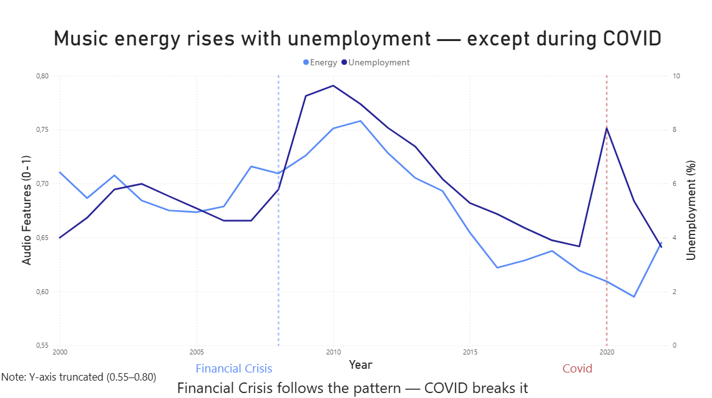
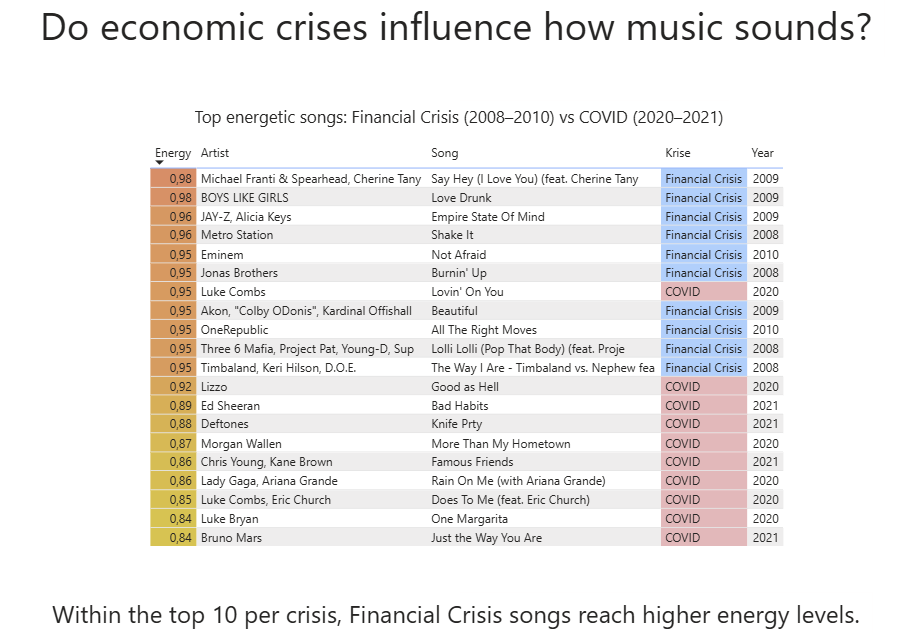

# Recession Pop: Music in Times of Economic Crisis

Do economic crises influence the way music sounds?

This project explores whether changes in the economy are reflected in popular music — and whether cultural patterns like “Recession Pop” can be detected in data.

## 📸 Key Visuals

### Music vs Economy

### Top Energetic Songs

## 🎯 Research Question

Do economic conditions in the United States influence musical characteristics — and if so, how?

## 🧠 Background

“Recession Pop” describes a wave of energetic, dance-oriented music that emerged during the late 2000s financial crisis.

This project investigates whether this phenomenon can be observed statistically using Billboard Hot 100 data and Spotify audio features — and whether a similar pattern appeared during COVID-19.

## 📊 Data Sources

- Billboard Hot 100 (1946–2022) with Spotify audio features  
- World Bank data (USA): unemployment, GDP, inflation  

### Audio Features

- **Valence** – how positive or happy a song sounds  
- **Energy** – intensity and activity level  
- **Danceability** – how suitable a song is for dancing  

## ⚙️ Methodology

- Aggregation of Billboard data by year  
- Merging with US economic indicators  
- Pearson correlation analysis  
- Lag analysis (1-year delay)  
- Statistical significance testing (p-values)  
- Data visualization using Power BI  

## 📈 Key Results

- **Energy** shows a strong positive correlation with unemployment *(r = 0.57, p = 0.005)*  
- Lag analysis suggests that music reacts to economic changes with a delay of ~1 year *(r = 0.63)*  
- **Danceability** shows a strong negative correlation *(r = -0.69)*  
- **Valence** shows almost no relationship *(r = 0.05)*  

### COVID-19

No clear “Recession Pop” effect was observed during COVID-19.

Possible explanations:
- Increased digital media consumption  
- Social isolation reducing collective escapism  

## ⚠️ Limitations

- Billboard reflects chart success, not actual listening behavior  
- Spotify audio features for older songs are retroactively calculated  
- Limited sample size (23 data points)  
- Correlation does not imply causation  

## 🧹 Data Cleaning

- 172 karaoke entries removed (false audio features)
- Artist name formatting cleaned

## 🛠️ Tools

- Python (Pandas, SciPy)  
- Power BI  

## 💡 Key Insight

Music does not exist in isolation.

It reflects cultural and economic realities — sometimes in ways that are measurable.